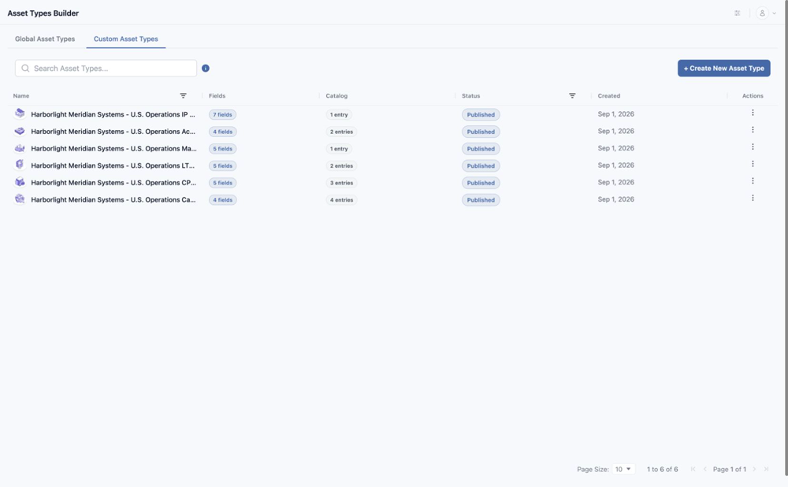
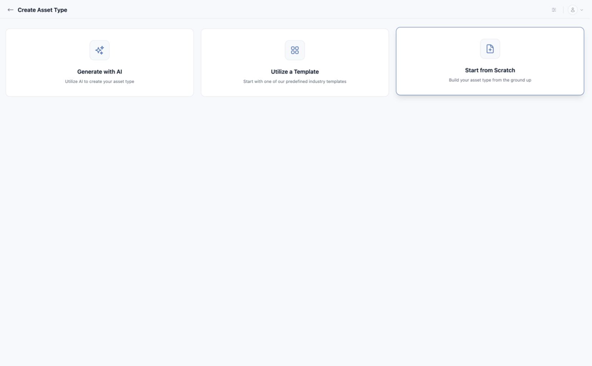

<!-- kb-meta
content-type: workflow
audience: customer administrator, data model owner
permission: ASSET_TYPES_BUILDER_CREATE
product-area: Asset Types and Service Catalog
content-owner: Product
review-owner: Support
last-verified: 2026-09-03
last-verified-release: pending
screenshot-set: asset-types-create
video-status: planned
release-status: draft
-->

# Create a custom Asset Type

**Outcome:** Create a named custom Asset Type and save it as a draft for further configuration.

**For:** Customer administrators and data model owners
**Permission:** Create in Asset Types
**Time:** 5–15 minutes
**Changes made:** Creates a shared draft schema

## Before you start

- Search existing Asset Types for the same concept.
- Write a one-sentence purpose and identify the first asset that will use it.
- Choose a durable customer-facing name.
- In Harbor Meridian Systems, begin documentation types with `Docs Demo`.

## Choose a starting option

1. Open **Administration → Asset Types**.
2. Select **+ Create New Asset Type**.
3. Choose one starting option:
   - **Generate with AI** for a suggested starting schema that you will review field by field.
   - **Utilize a Template** when an available template closely matches the use case.
   - **Start from Scratch** when you need full control or a small schema.

4. Complete the prompts for the selected option.
5. Enter the Asset Type **Name** and **Description**.
6. Review the generated or copied sections and fields.
7. Select **Save Draft**.

**Expected result:** The Asset Type appears in the list with **Draft** status.

If generation fails or produces unsuitable fields, return to the starting options or remove the unwanted draft fields before saving. Do not publish unreviewed generated content.

## Check your result

1. Return to **Administration → Asset Types**.
2. Search for the exact name.
3. Confirm the status is **Draft**.
4. Reopen it and verify the name and description.

## Undo this change

Delete only an unused draft after confirming it has no catalog entries or test assets. Do not use deletion to revise a field; edit the draft instead.

## Learn, show me, do it

- **Learn:** [Understand Asset Types and Service Catalogs](understand-asset-types-and-service-catalogs)
- **Show me:** The Asset Type and Service Catalog clip will show all three starting options after publication.
- **Do it:** Open `/administration/asset-types/create` in your WanAware workspace.

## Next steps

- [Configure Asset Type sections and fields](configure-asset-type-sections-and-fields)
- [Create a custom Service Catalog](create-a-custom-service-catalog)

## Get help

Email [support@wanaware.com](mailto:support@wanaware.com?subject=Help%20creating%20a%20WanAware%20Asset%20Type) with your company, affected user, draft name or ID, selected starting option, page URL, timestamp and time zone, reproduction steps, and exact error. Never send passwords, credentials, tokens, or secret values.
