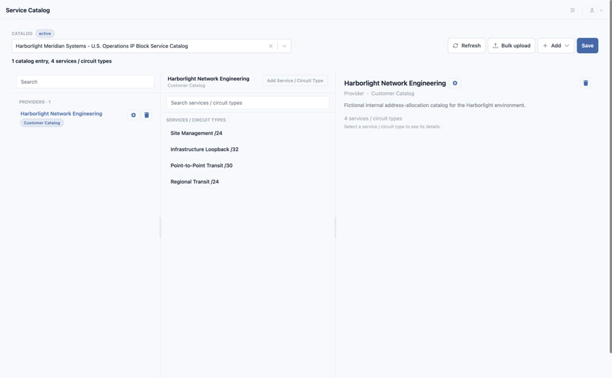

<!-- kb-meta
content-type: workflow
audience: customer administrator, data model owner
permission: SERVICE_CATALOG_UPDATE
product-area: Asset Types and Service Catalog
content-owner: Product
review-owner: Support
last-verified: 2026-09-03
last-verified-release: pending
screenshot-set: service-catalog-create
video-status: planned
release-status: draft
-->

# Create a custom Service Catalog

**Outcome:** Select a draft custom Asset Type, add an approved catalog entry, and save the catalog.

**For:** Customer administrators and data model owners
**Permission:** Update Service Catalog
**Time:** 10–20 minutes
**Changes made:** Creates shared catalog data for a draft Asset Type

## Before you start

- Complete the draft Asset Type's sections, fields, dependencies, and catalog support.
- Keep the Asset Type unpublished.
- Gather the approved catalog names and source references.
- Search for existing entries before adding a new one.

## Start the catalog

1. Open **Administration → Service Catalog**.
2. Use the catalog selector to choose the draft custom Asset Type.
3. Confirm the selected type is the intended draft.
4. Select **Add**.
5. Choose the supported entry type needed by the schema.
6. Enter a clear name and the available descriptive fields.
7. Add only approved specifications or attributes.
8. Select **Save**.

**Expected result:** The entry appears in the selected Asset Type's catalog after a refresh.

If the Asset Type is unavailable, confirm that it was saved as a customer draft and that your role includes Service Catalog access. A published custom type may no longer allow catalog editing.

## Check your result

1. Select **Refresh**.
2. Re-select the draft Asset Type.
3. Find the entry by its exact name.
4. Open it and confirm the saved details.

## Undo this change

Edit or remove an unused custom entry only while the draft lifecycle permits it and after checking dependencies and compatibility. Do not remove an entry already selected by test or customer assets without an impact review.

## Learn, show me, do it

- **Learn:** [Understand Asset Types and Service Catalogs](understand-asset-types-and-service-catalogs)
- **Show me:** The Asset Type and Service Catalog clip will include the first catalog entry after publication.
- **Do it:** Open `/administration/service-catalog` in your WanAware workspace.

## Next steps

- [Add catalog entries and compatibility](add-catalog-entries-and-compatibility)
- [Publish and verify an Asset Type](publish-and-verify-an-asset-type)

## Get help

Email [support@wanaware.com](mailto:support@wanaware.com?subject=Help%20creating%20a%20WanAware%20Service%20Catalog) with your company, affected user, draft Asset Type ID, catalog entry name and type, page URL, timestamp and time zone, reproduction steps, and exact error. Never send passwords, credentials, tokens, or secret values.
