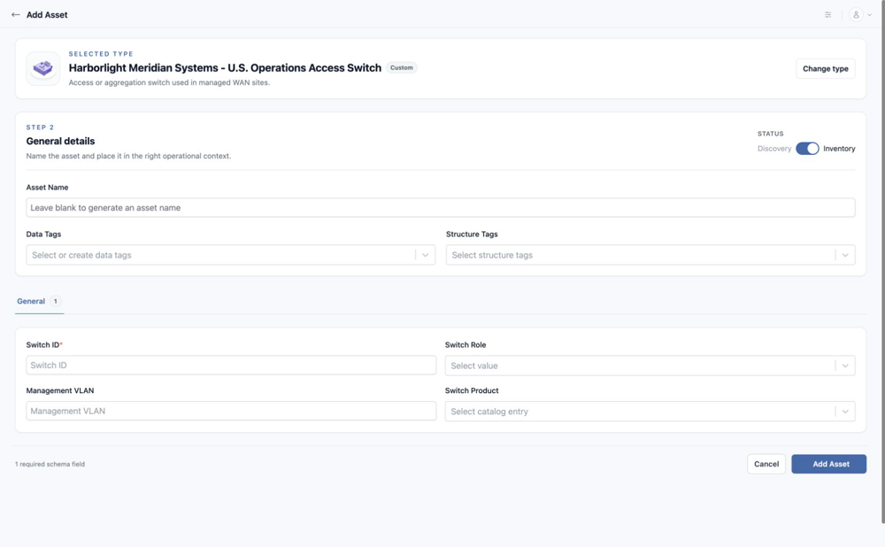

<!-- kb-meta
content-type: workflow
audience: customer administrator, engineer
permission: ASSETS_CREATE
product-area: Assets
content-owner: Product
review-owner: Support
last-verified: 2026-09-03
last-verified-release: pending
screenshot-set: assets-add-import
video-status: planned
release-status: draft
-->

# Add or import assets

**Outcome:** Create asset records and confirm that they appear in the intended workspace.

**For:** Customer administrators and engineers
**Permission:** Create Assets
**Time:** About 5 minutes for one asset; bulk imports vary
**Changes made:** Creates shared asset records

## Before you start

- Search for the asset first to avoid duplicates.
- Choose **Inventory** or **Discovery** according to your team's process.
- Confirm the correct Asset Type and its required fields.
- In Harbor Meridian Systems, use names that begin with `Docs Demo`.
- For bulk upload, use the current template from the uploader and sanitized data only.

## Add one asset

1. Open **Functions → Assets → Inventory**.
2. Select **Add Asset**.
3. Choose the **Asset Type**.
4. Set **Status** to **Inventory** or **Discovery**.
5. Enter **Asset Name** and the required fields shown for the Asset Type.
6. Add Data Tags or Structure Tags only when their purpose is clear.
7. Select **Add Asset**.

**Expected result:** WanAware shows **Asset Added!** and identifies where the asset was added.

8. Select **View Asset** to verify it, **Add Another** to continue, or **Done** to close.

If the expected fields are missing, stop and confirm the Asset Type. Changing type later may not preserve every value.

## Import assets in bulk

1. Open the bulk-upload action from Assets when it is available to your role.
2. Download the current template.
3. Keep its column names unchanged and enter one asset per row.
4. Upload the file.
5. Review the validation results before submitting.
6. Correct rejected rows in the source file and upload the corrected file.
7. Submit only after the accepted and rejected counts make sense.

**Expected result:** The uploader accepts valid rows and reports rejected rows with validation details. Processing may continue in the background.

For rejected rows, use [Bulk-import validation failures](../troubleshooting-and-support/bulk-import-validation-failures).

## Check your result

1. Open **Assets → Inventory** or **Discovery** according to the selected status.
2. Clear existing filters.
3. Search for a unique new asset name.
4. Open the asset and confirm its name, Asset Type, status, and required fields.
5. For bulk import, compare the submitted count with accepted, rejected, and visible records.

## Undo this change

Correct an editable field instead of deleting the asset. Before deletion, review its relationships, Structure Tags, and Element or Collection attachments. Remove only documentation records you created and have verified are not shared.

## Learn, show me, do it

- **Learn:** [Understand Asset Types and Service Catalogs](../asset-types-and-service-catalog/understand-asset-types-and-service-catalogs)
- **Show me:** The captioned add-or-import clip will be embedded after its Harbor Meridian Systems recording passes review.
- **Do it:** Open `/assets/new` or `/assets/new/bulk` in your WanAware workspace.

## Next steps

- [Populate asset details](populate-asset-details)
- [Find, filter, and inspect assets](find-filter-and-inspect-assets)

## Get help

Email [support@wanaware.com](mailto:support@wanaware.com?subject=Help%20adding%20or%20importing%20WanAware%20assets) with your company, affected user, Asset Type, page URL, import timestamp and time zone, row number or asset ID, reproduction steps, and exact validation text. Never attach credentials, tokens, secrets, or customer-sensitive data.
