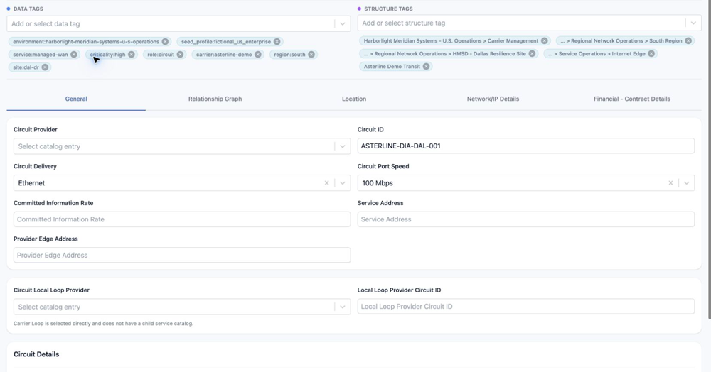

<!-- kb-meta
content-type: workflow
audience: customer administrator, engineer
permission: ASSETS_UPDATE
product-area: Assets
content-owner: Product
review-owner: Support
last-verified: 2026-09-03
last-verified-release: pending
screenshot-set: assets-tags
video-status: not-planned
release-status: draft
-->

# Manage Data Tags and Structure Tags on an asset

**Outcome:** Apply the correct kind of tag and verify the asset appears in the intended context.

**For:** Customer administrators and engineers
**Permission:** Update Assets and the relevant tag relationship
**Time:** 3–5 minutes
**Changes made:** Changes a shared asset's descriptive or organizational attachments

## Before you start

- Use a **Data Tag** for a descriptive label.
- Use a **Structure Tag** to attach the asset to an existing hierarchy node.
- Search existing tags before creating or applying a near-duplicate.

## Add or remove tags

1. Open the intended asset and confirm its unique identifier.
2. Find the Data Tags or **Structure Tags** control.
3. Search for the existing tag.
4. Select it to add the attachment, or clear it to remove the attachment.
5. Use the page's save action when an unsaved-change bar appears.

**Expected result:** The selected tags remain after a page refresh.

If a tag does not appear, confirm that it exists, applies to the current company, and your role can create the relationship.

## Check your result

Refresh the asset, then use the inventory filter for the selected tag. Confirm that the asset appears once in the expected result.

## Undo this change

Remove the tag you added or reapply the one you removed, then save and verify again. Removing a tag should not be used as a substitute for deleting its Structure.

## Learn, show me, do it

- **Learn:** [Understand Structures, Elements, and Collections](../structures-elements-and-collections/understand-structures-elements-and-collections)
- **Show me:** Use the written steps until a tag-specific clip is approved.
- **Do it:** Open an asset from `/assets/inventory`.

## Get help

Email [support@wanaware.com](mailto:support@wanaware.com?subject=WanAware%20asset%20tag%20help) with your company, affected user, asset ID, tag name or ID, page URL, timestamp and time zone, and expected versus actual result. Never send passwords, credentials, tokens, or secret values.
