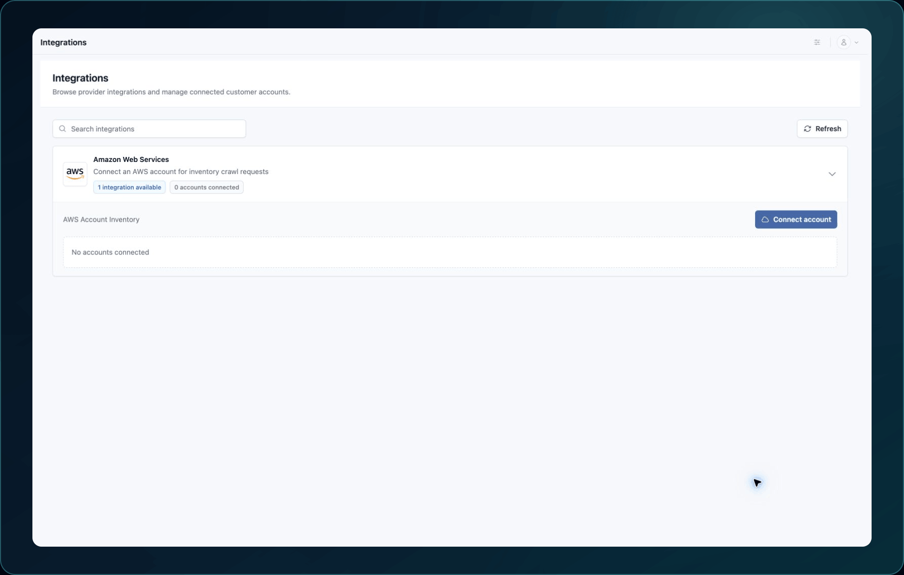
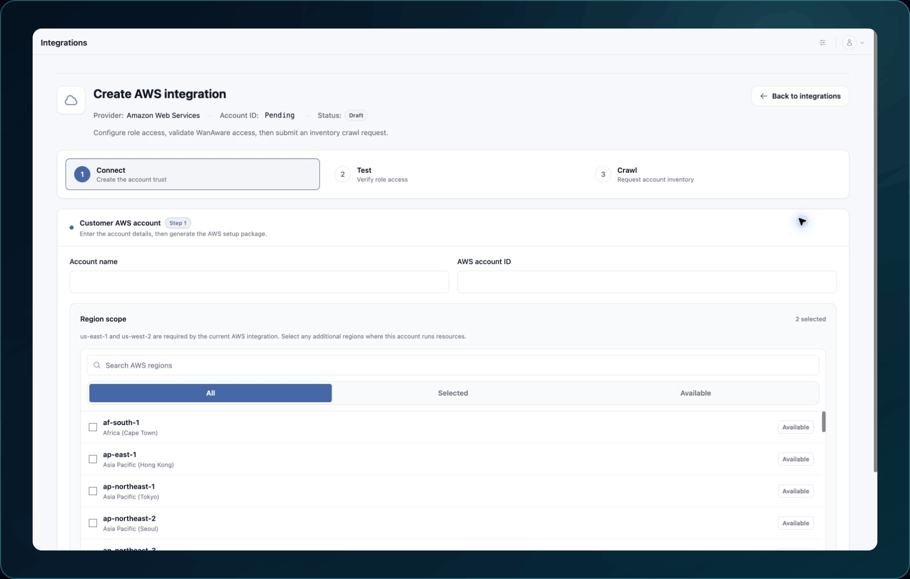

{/* kb-meta
content-type: workflow
audience: customer administrator, cloud administrator
permission: ADMINISTRATION, INTEGRATIONS
product-area: Integrations
content-owner: Product
review-owner: Support
last-verified: 2026-09-03
last-verified-release: pending
screenshot-set: integrations-provider-aws
video-status: not-planned
release-status: draft
*/}

# Amazon Web Services integration adapter

**Outcome:** Authorize WanAware to collect supported AWS account inventory through the released role-based setup.

**For:** WanAware customer administrators and AWS account administrators
**Permission:** Manage Integrations in WanAware and create the requested stack in the AWS account
**Time:** About 10 minutes, plus stack deployment time **Changes made:** Saves an AWS connection in WanAware and creates provider-side resources through CloudFormation

## Before you start

- Get approval from the AWS account owner.
- Confirm the 12-digit account ID without including it in screenshots or support messages unless sanitized.
- Use the released generated stack; do not substitute long-lived access keys.
- Review the stack's permissions before deployment.

## Complete the adapter fields

1. Open **Administration → Integrations**.
2. Expand **Amazon Web Services**.
3. For **AWS Account Inventory**, select **Connect account**.
4. Enter a recognizable account name and the 12-digit **AWS account ID**.

5. Select **Generate AWS setup**.
6. Open the generated CloudFormation setup and review it in the intended AWS account and Region.
7. Deploy the stack after the account owner approves it.
8. Return to WanAware and confirm that the **Role ARN** matches the created role.
9. Save the integration.

**Expected result:** The account appears on the integration card with a connected status.

If the stack or role does not match, stop before repeating deployment. Record the stack status and exact error, without copying credential values.

## Test and collect

1. Select **Test connection**.
2. Wait for a successful connection result.
3. Select **Run inventory crawl**.
4. Wait for the request confirmation, then verify a known record in **Assets → Inventory**.

## Check your result

Open one imported asset and confirm its AWS account context and source identifier match the intended account.

## Undo this change

Removing the WanAware connection does not automatically delete the CloudFormation stack. Coordinate these as separate actions:

1. Confirm that no one still needs the collected inventory.
2. Remove or disable the WanAware connection using the released action.
3. Ask the AWS account owner to review and delete the stack if it is no longer required.

## Learn, show me, do it

- **Learn:** [About integrations](../about-integrations)
- **Show me:** Use the general integration clip for the shared WanAware steps after publication.
- **Do it:** Open `/administration/integrations` in your WanAware workspace.

## Get help

Email [support@wanaware.com](mailto:support@wanaware.com?subject=WanAware%20AWS%20integration%20help) with your company, affected user, sanitized integration identifier, failed stage, stack status, page URL, timestamp and time zone, and exact error. Never send an account credential, access key, token, role secret, external ID, or private key.
