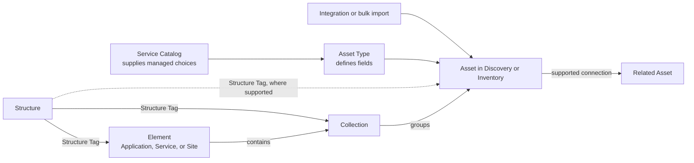

<!-- kb-meta
content-type: concept
audience: customer
permission: none
product-area: Platform
content-owner: Product
review-owner: Support
last-verified: 2026-09-03
last-verified-release: pending
screenshot-set: start-product-map
video-status: not-planned
release-status: draft
-->

# Product map and terminology

The left navigation shows only the areas included in your company's subscription and allowed by your active Role. Opening a direct URL does not bypass those checks.

Throughout this knowledge base, capitalized words such as **Asset**, **Asset Type**, **Structure**, **Element**, **Discovery**, and **Inventory** are WanAware product labels or record types. Lowercase words are generic. Permission names remain lowercase because they match their IAM identifiers.

## Navigation and permission map

Permissions are written as `action resource`. When a row lists more than one permission, your Role needs all of them for the area to appear and open successfully.

| Area | What you use it for | Portal path | Permission that makes it visible |
| --- | --- | --- | --- |
| **Launchpad** | Review workspace summaries and move into a detailed workflow. | `/launchpad` | `read my_launchpad` |
| **Functions** | Open the first-release operational areas listed below. | No page of its own | No direct permission; the container appears when at least one child area is visible. |
| **Functions → Structures** | Model an organizational or logical hierarchy. | `/structures` | `read structures` |
| **Functions → Assets** | Review Discovery and Inventory, edit Asset details, and explore Relationships. | `/assets/inventory` | `read assets` |
| **Functions → Elements** | Manage Applications, Services, Sites, and their Collections. | `/elements` | `read elements` |
| **Administration** | Open the company-management areas listed below. | No page of its own | No direct permission; the container appears when at least one child area is visible. |
| **Administration → General** | Manage permitted company settings. | `/administration/general/company` | `view general` and `view company_information` |
| **Administration → Integrations** | Connect supported data sources and refresh imported data. | `/administration/integrations` | `read integrations` |
| **Administration → IAM** | Invite members and assign Roles. | `/administration/iam` | `read users` — the resource is named `users`, not `iam`. |
| **Administration → Asset Types** | Define custom Asset schemas and their lifecycle. | `/administration/asset-types` | `read asset_types_builder` |
| **Administration → Service Catalog** | Manage approved catalog data for custom Asset Types. | `/administration/service-catalog` | `read service_catalog` |
| **Administration → Billing** | Review plans, usage, payment settings, and billing history. | `/administration/billing` | `read billing`, `read billing_history`, `read my_subscriptions`, and `read payment_methods` |
| **My Profile** | Manage your profile and security settings. | `/profile/general` | `view my_profile` |
| **Theme Settings** | Choose your personal Light or Dark appearance and an available preset. | Top-bar drawer; no page URL | Available to a signed-in user; there is no separate feature permission. |
| **Support** | Open the in-product Support area. | `/support` | `view support` |

The navigation requirement controls entry to an area. Create, update, delete, publish, attach, and other actions can require additional permissions. If a page or action is missing, use [Missing pages, actions, or permissions](../troubleshooting-and-support/missing-pages-actions-or-permissions).

## How the records fit together

An Asset can arrive from an Integration or a bulk import. A Collection groups existing Assets inside an Element. A Structure Tag attaches an Element, Collection, or other supported record to the Structure hierarchy; matching names alone do not create that attachment.

## These sound alike

| If you are trying to... | Use | Do not confuse it with |
| --- | --- | --- |
| Build a company, organizational, group, or vendor hierarchy | **Structure** | An **Element**, which represents an operational unit |
| Represent an Application, Service, or Site | **Element** | A **Structure**, which provides hierarchy |
| Represent a location and manage Site Assets or Location details | A **Site** Element | A **Collection**, which groups Assets for a purpose |
| Group existing Assets inside an Element | **Collection** | A **Structure**, which does not contain Assets directly |
| Review Assets that were found and may still need attention | **Discovery** | **Inventory**, the maintained Asset set |
| Work with the maintained Asset set | **Inventory** | **Discovery**, the review workspace |
| Define the sections, fields, and dependencies for a kind of Asset | **Asset Type** | **Service Catalog**, which supplies managed choices |
| Manage approved manufacturers, models, software, attributes, or compatibility | **Service Catalog** | **Asset Type**, which defines the schema |
| Attach a supported record to the organizational hierarchy | **Structure Tag** | **Data Tag**, which labels data without placing it in the hierarchy |
| Give members a reusable bundle of access | **Role** | A **Permission**, which allows one action on one resource |
| Inspect how one Asset is connected to another | **Relationship Graph** | A **Collection** or **Structure Tag**, which organizes records but does not create an arbitrary Relationship |

## Core terms

### Integration

A managed connection between WanAware and a supported data source. Each provider can have its own adapter instructions.

- **Where:** **Administration → Integrations** (`/administration/integrations`)
- **See also:** [About integrations](../integrations/about-integrations)

### Asset

A resource tracked by WanAware. An Asset has an Asset Type, status, details, tags, and Relationships.

- **Where:** **Functions → Assets → Inventory** (`/assets/inventory`)
- **See also:** [Find, filter, and inspect Assets](../assets-and-relationships/find-filter-and-inspect-assets)

### Discovery

The workspace for Assets that have been found or are still being reviewed.

- **Where:** **Functions → Assets → Discovery** (`/assets/discovery`)
- **See also:** [Find, filter, and inspect Assets](../assets-and-relationships/find-filter-and-inspect-assets)

### Inventory

The maintained set of Assets used throughout WanAware.

- **Where:** **Functions → Assets → Inventory** (`/assets/inventory`)
- **See also:** [Verify imported Inventory](../integrations/verify-imported-inventory)

### Asset Type

The schema that defines an Asset's sections, fields, dependencies, and catalog support.

- **Where:** **Administration → Asset Types** (`/administration/asset-types`)
- **See also:** [Understand Asset Types and Service Catalogs](../asset-types-and-service-catalog/understand-asset-types-and-service-catalogs)

### Service Catalog

Managed information used by an Asset Type, including manufacturers, models, modules, software, specifications, attributes, and compatibility where supported.

- **Where:** **Administration → Service Catalog** (`/administration/service-catalog`)
- **See also:** [Create a custom Service Catalog](../asset-types-and-service-catalog/create-a-custom-service-catalog)

### Relationship

A connection derived from supported data or created by a specific product flow. WanAware does not provide a general-purpose action for drawing arbitrary Relationships.

- **Where:** **Functions → Assets → [Asset] → Relationship Graph** (`/assets/{assetId}/summary/relationship-graph`)
- **See also:** [View Asset Relationships](../assets-and-relationships/view-asset-relationships)

### Structure

A hierarchy made from supported Structure types such as Company, Organization, Group, and Vendor.

- **Where:** **Functions → Structures** (`/structures`)
- **See also:** [Create and manage Structures](../structures-elements-and-collections/create-and-manage-structures)

### Structure Tag

An attachment to a Structure node. Structure Tags connect supported records, including Elements and Collections, to the hierarchy.

- **Where:** The details for a supported Asset, Element, or Collection; there is no separate Structure Tag page.
- **See also:** [Manage Data Tags and Structure Tags](../assets-and-relationships/manage-asset-and-structure-tags)

### Data Tag

A label used to classify or filter supported records without attaching them to the Structure hierarchy.

- **Where:** The details for a supported Asset, Element, or Collection; there is no separate Data Tag page.
- **See also:** [Manage Data Tags and Structure Tags](../assets-and-relationships/manage-asset-and-structure-tags)

### Element

An Application, Service, or Site used to represent an operational unit.

- **Where:** **Functions → Elements** (`/elements`)
- **See also:** [Create and populate Elements](../structures-elements-and-collections/create-and-populate-elements)

### Site

A location-oriented type of Element. A Site can include supported Site Assets and Location details.

- **Where:** **Functions → Elements → [Site]** (`/elements/{elementId}/site-assets`)
- **See also:** [Manage Site details](../structures-elements-and-collections/manage-site-details)

### Collection

A named group of existing Assets inside an Element.

- **Where:** **Functions → Elements → [Element] → Collections** (`/elements/{elementId}/collections`)
- **See also:** [Create Collections and add Assets](../structures-elements-and-collections/create-collections-and-add-assets)

### Role

A named set of Permissions assigned to members. A Role controls which pages and actions a member can use.

- **Where:** **Administration → IAM → Roles** (`/administration/iam/roles`)
- **See also:** [Understand Roles and Permissions](../administration-and-personal-settings/understand-roles-and-permissions)

### Permission

An allowed action on a resource, such as `read assets`. Permissions are collected into Roles rather than assigned as navigation labels.

- **Where:** **Administration → IAM → Roles → [Role]** (`/administration/iam/roles/{roleKey}`)
- **See also:** [Missing pages, actions, or permissions](../troubleshooting-and-support/missing-pages-actions-or-permissions)

## Learn, show me, do it

- **Learn:** Use this page as the glossary and navigation map for the first release.
- **Show me:** Use the short clips linked from the matching task guides after publication.
- **Do it:** Start with [Choose your path](choose-your-path).

## Get help

Email [support@wanaware.com](mailto:support@wanaware.com?subject=WanAware%20terminology%20question) with your company, affected user, page URL, timestamp and time zone, and a screenshot with sensitive details removed. Never send passwords, credentials, tokens, or secret values.
