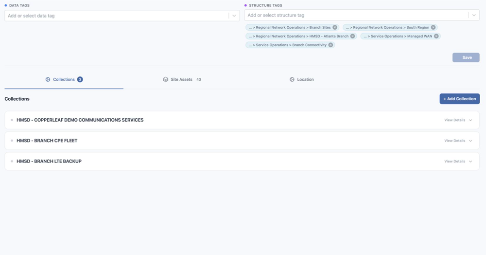

<!-- kb-meta
content-type: workflow
audience: customer administrator, engineer
permission: ELEMENTS_UPDATE, STRUCTURE_TAG_RELATIONSHIP
product-area: Structures, Elements, and Collections
content-owner: Product
review-owner: Support
last-verified: 2026-09-03
last-verified-release: pending
screenshot-set: elements-structure-tags
video-status: planned
release-status: draft
-->

# Attach Elements to Structures

**Outcome:** Attach an Element to the intended Structure node with a Structure Tag.

**For:** Customer administrators and engineers
**Permission:** Update Elements and Structure Tag relationships
**Time:** 3–5 minutes
**Changes made:** Changes a shared hierarchy attachment

## Before you start

- Confirm the Structure node exists and has the right type and parent.
- Confirm the Element's name, type, and ID.
- Check current Structure Tags to avoid a duplicate or conflicting attachment.

## Add or remove the attachment

1. Open **Functions → Elements** and select the Element.
2. Find **Structure Tags** in the Element details.
3. Search for the intended Structure node.
4. Select the tag to attach it, or clear the selected tag to detach it.
5. Select the available save action if an unsaved-change state appears.

**Expected result:** The intended Structure Tag remains selected after refresh.

If the tag is missing, verify the Structure and your relationship permission. Do not create a second Structure with a similar name.

## Check your result

Refresh the Element and confirm the selected Structure Tag. Open **Structures**, expand the intended node, and verify the Element appears in the supported view.

## Undo this change

Remove the tag you added or reapply the one you removed, save, and repeat the verification. Detaching an Element should not delete the Element or the Structure.

## Learn, show me, do it

- **Learn:** [Understand Structures, Elements, and Collections](understand-structures-elements-and-collections)
- **Show me:** The organization clip will show the Element attachment after publication.
- **Do it:** Open `/elements` and select the intended Element.

## Get help

Email [support@wanaware.com](mailto:support@wanaware.com?subject=WanAware%20Element%20Structure%20attachment%20help) with your company, affected user, Element ID, Structure Tag name or ID, page URL, timestamp and time zone, and expected versus actual result. Never send passwords, credentials, tokens, or secret values.
