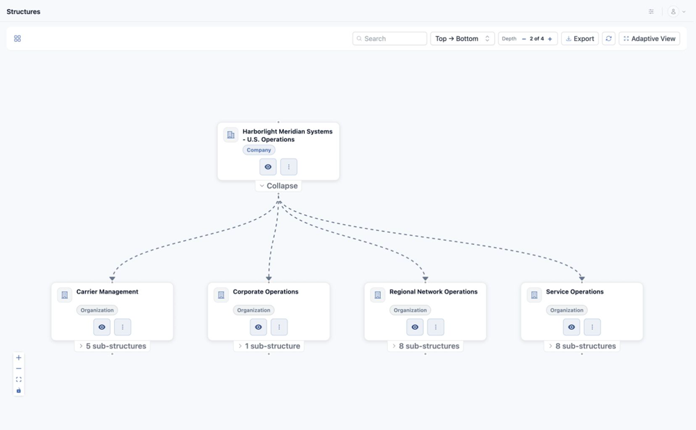

<!-- kb-meta
content-type: workflow
audience: customer administrator
permission: STRUCTURES_CREATE
product-area: Structures, Elements, and Collections
content-owner: Product
review-owner: Support
last-verified: 2026-09-03
last-verified-release: pending
screenshot-set: structures-create
video-status: planned
release-status: draft
-->

# Create and manage Structures

**Outcome:** Create a Structure node of the correct type and place it in the intended hierarchy.

**For:** Customer administrators and environment model owners
**Permission:** Create or update Structures
**Time:** 5–10 minutes
**Changes made:** Creates or changes a shared hierarchy node

## Before you start

- Search the hierarchy for the intended name and common variations.
- Choose the supported type that matches the concept: Company, Organization, Group, or Vendor.
- Identify the correct parent and owner.
- In Harbor Meridian Systems, start documentation names with `Docs Demo`.

## Create a Structure

1. Open **Functions → Structures**.
2. Select **Add Structure**.
3. Choose the **Structure Type**.
4. Enter a clear **Name**.
5. Select the intended parent or placement when the form provides that choice.
6. Review the placement preview.
7. Select **Save**.

**Expected result:** The new node appears once under the intended parent.

If a parent cannot be selected, the type may not be valid at that level. Choose a valid placement instead of creating a duplicate elsewhere.

## Edit a Structure

1. Select the existing node.
2. Open its edit action.
3. Confirm the node's ID and attachments.
4. Change only the approved name or supported setting.
5. Select **Save** and reopen the node.

## Check your result

Search for the exact name, expand its parent, and confirm the type, location, and child records. Then check an attached Element or Collection if one already exists.

## Undo this change

Restore the previous editable value when possible. Before removing a Structure, detach its Elements and Collections and review its child nodes. Do not delete the attached assets themselves.

## Learn, show me, do it

- **Learn:** [Understand Structures, Elements, and Collections](understand-structures-elements-and-collections)
- **Show me:** The organization clip will show a small hierarchy after publication.
- **Do it:** Open `/structures` in your WanAware workspace.

## Next steps

- [Create and populate Elements](create-and-populate-elements)
- [Attach Elements to Structures](attach-elements-to-structures)

## Get help

Email [support@wanaware.com](mailto:support@wanaware.com?subject=WanAware%20Structure%20help) with your company, affected user, Structure name and ID, parent ID, page URL, timestamp and time zone, reproduction steps, and expected versus actual placement. Never send passwords, credentials, tokens, or secret values.
