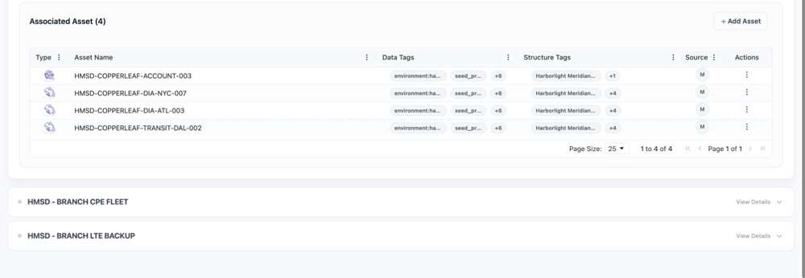

<!-- kb-meta
content-type: workflow
audience: customer administrator, engineer
permission: ELEMENT_COLLECTIONS_CREATE, ELEMENT_COLLECTIONS_UPDATE
product-area: Structures, Elements, and Collections
content-owner: Product
review-owner: Support
last-verified: 2026-09-03
last-verified-release: pending
screenshot-set: collections-create-assets
video-status: planned
release-status: draft
-->

# Create Collections and add assets

**Outcome:** Create a named Collection inside an Element and add the intended assets once.

**For:** Customer administrators and engineers
**Permission:** Create and update Element Collections
**Time:** 5–10 minutes
**Changes made:** Creates a shared Collection and asset associations

## Before you start

- Open the intended Element and confirm its ID.
- Search its current Collections for the same purpose.
- Gather unique identifiers for the assets you intend to add.

## Create the Collection

1. Open **Functions → Elements** and select the Element.
2. Open **Collections**.
3. Select **+ Add Collection**.
4. Enter a clear Collection name.
5. Search for and select the intended assets.
6. Confirm each asset's name, Asset Type, and unique identifier.
7. Save the Collection.

**Expected result:** The Collection appears once inside the Element and lists the selected assets.

If an asset is missing from the selector, clear its filters and confirm that the asset is in Inventory and visible to your role.

## Add or remove assets later

1. Open the Collection.
2. Use its edit or asset-selection action.
3. Add or clear the intended asset selection.
4. Save and reopen the Collection.

Associating an asset does not create a duplicate asset. Removing an association does not delete the asset.

## Check your result

Open the Collection and compare every listed asset ID with the intended set. Confirm no similarly named asset was selected by mistake.

## Undo this change

Detach an incorrect asset from the Collection. Before deleting the Collection, review all assets and Structure Tags attached to it. Do not delete the assets themselves.

## Learn, show me, do it

- **Learn:** [Understand Structures, Elements, and Collections](understand-structures-elements-and-collections)
- **Show me:** The organization clip will show Collection creation and asset selection after publication.
- **Do it:** Open `/elements`, choose an Element, and select **Collections**.

## Next steps

- [Attach Collections to Structures](attach-collections-to-structures)
- [Manage Site details](manage-site-details)

## Get help

Email [support@wanaware.com](mailto:support@wanaware.com?subject=WanAware%20Collection%20help) with your company, affected user, Element and Collection IDs, affected asset ID, page URL, timestamp and time zone, and expected versus actual membership. Never send passwords, credentials, tokens, or secret values.
